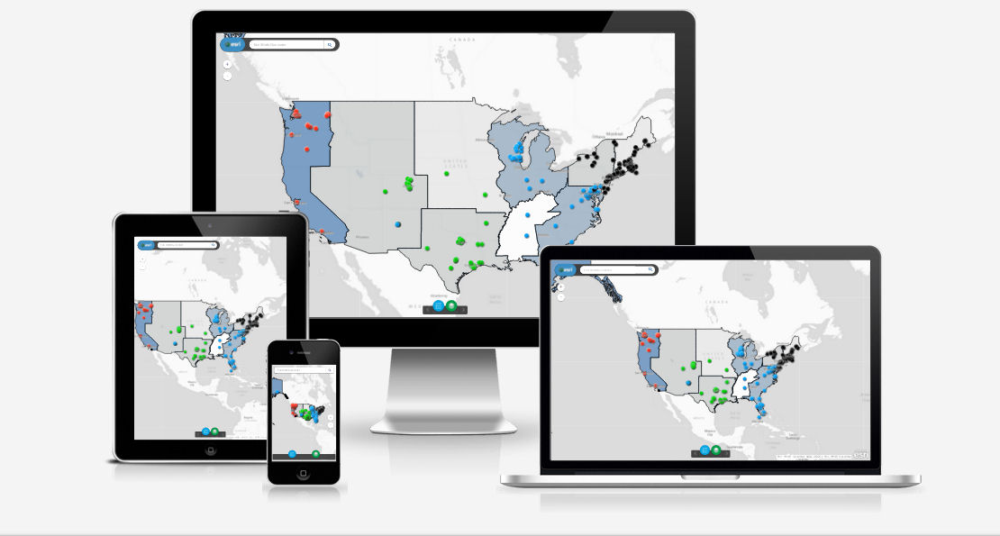

# TNRIS-Workshop

Designed for the TNRIS conference to learn how to build apps with Web AppBuilder and AppStudio. 

## Getting Started

Follow these steps to prepare for the workshop.

1. Sign up for an [ArcGIS Developer subscription](https://developers.arcgis.com/en/sign-up/).
2. Login to [ArcGIS Online](http://arcgis.com).
 * Search for `Tnris Workshop` > `Search Groups`.
 * Uncheck `Only search in my account/organization`.
 * Join the group.
3. Sign up for a GitHub account if you don't have one.
