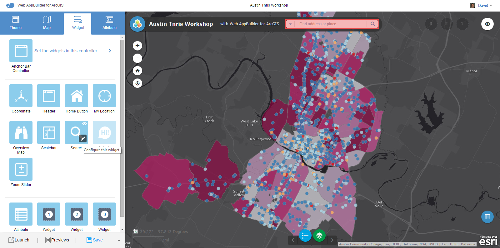

### Web AppBuilder Configurable Widget

In this lab you will add a configurable Widget to Web AppBuilder.

1. [Download FeatureLayer Filter Widget] (wab/FeatureLayer_filter.zip?raw=true) unzip it and copy the folder to the widgets directory for Web AppBuilder(e.g., webappbuilder\client\stemapp\widgets).

2. Open Web AppBuilder in the browser and click `Create New` > `Default` > `Next` and give it a title and description and click `OK`.

2. In `Theme` Click `Launchpad Theme`.

3. Click `Map` > `Choose Web Map` > `Public` > `ArcGIS.com` and search for `tnris inspection scores`. Click the `Restaurant Inspection Scores Austin` map and click `OK`.

4. Click `Widget`
  * Click `Anchor Bar Controller` > `+` to add a new widget > click `Time Slider` widget and `Inspection Rating Filter` > click `OK`.



6. Click `Attribute` and change the subtitle to `Inspection Ratings`.

7. Click `Save`.

8. Click `Launch` to test the application. On map load you will notice there are no features on the map. Click `Inspection Ratings Filter` button to filter features by ratings by count and extent. This is an example of how to query a feature service, however what if we wanted to load query results when the map is loaded?

9. Click the widgets folder (e.g., webappbuilder\server\apps\1) for your existing application.

10. Click `config.json` and open that file. Scroll down to line 229, if you're not using a code editor look for
```json 
        "name": "FeatureLayer_filter",
        "label": "Inspection Ratings Filter",
        "version": "0.1.1",
        "uri": "widgets/FeatureLayer_filter/Widget",
        "index": 5,
        "id": "widgets_FeatureLayer_filter_Widget_32" 

```
11. Under `index` add `"openAtStart": true,` > click `Save`. This will launch the Inspection Ratings Filter when the map loads. Your JSON should now appear as below:
```json
        "name": "FeatureLayer_filter",
        "label": "Inspection Ratings Filter",
        "version": "0.1.1",
        "uri": "widgets/FeatureLayer_filter/Widget",
        "index": 5,
        "openAtStart": true,
        "id": "widgets_FeatureLayer_filter_Widget_32"

```
4. Launch your application and .


