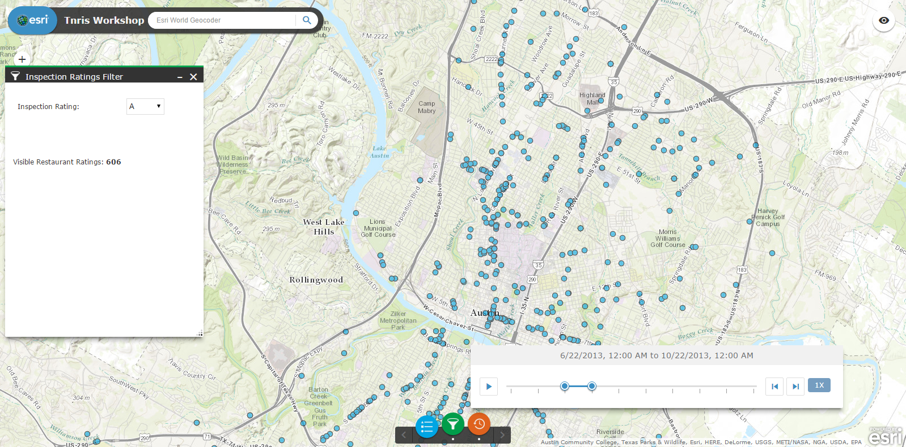

### Web AppBuilder Configurable Widget

In this lab you will add a configurable Widget to Web AppBuilder.

1. [Download FeatureLayer Filter Widget] (wab/FeatureLayer_filter.zip?raw=true) unzip it and copy the folder to the widgets directory for Web AppBuilder(e.g., webappbuilder\client\stemapp\widgets).

2. Open Web AppBuilder in the browser and click `Create New` > `Default` > `Next` and give it a title and description and click `OK`.

3. In `Theme` click `Launchpad Theme` > click `Map` > `Choose Web Map` > `Public` > `ArcGIS.com` and search for `tnris inspection scores`. Click the `Restaurant Inspection Scores Austin` map and click `OK`.

4. Click `Widget` > click `Anchor Bar Controller` > `+` to add a new widget > click `Time Slider` and `Inspection Rating Filter` > click `OK`.

 

5. Click `Attribute` and change the subtitle to `Inspection Ratings` > click `Save`.

6. Click `Launch` to test the application. On map load you will notice there are no features on the map. Click `Inspection Ratings Filter` button to filter features by ratings and extent. This is an example of how to query a feature service. However, what if we wanted to load query results when the map is loaded?

7. Click the widgets folder (e.g., webappbuilder\server\apps\1) for your existing application.

8. Double click `config.json` to open it. Scroll down to line 229, if you're not using a code editor that has number lines look for
 ```json 
        "name": "FeatureLayer_filter",
        "label": "Inspection Ratings Filter",
        "version": "0.1.1",
        "uri": "widgets/FeatureLayer_filter/Widget",
        "index": 5,
        "id": "widgets_FeatureLayer_filter_Widget_32" 

 ```
9. Under `index` add `"openAtStart": true,` > click `Save`. This will launch the Inspection Ratings Filter widget when the app opens. Your JSON should now appear as below:
 ```json
         "name": "FeatureLayer_filter",
         "label": "Inspection Ratings Filter",
        "version": "0.1.1",
        "uri": "widgets/FeatureLayer_filter/Widget",
        "index": 5,
        "openAtStart": true,
        "id": "widgets_FeatureLayer_filter_Widget_32"

 ```
10. Launch your application and you will notice the features for "A" rating restaurants load with the app. This feature service contains over 10,000 features and the filter certainly helps with querying the information based on rating. However, there are just too many points to visually understand this data. This data also contains an inspection date field which will allow us to query by rating and date. Click `Time Slider` widget and click the `play` button to visualize this data over time and rating. Change the ratings to see how the data changes by months and areas.    


