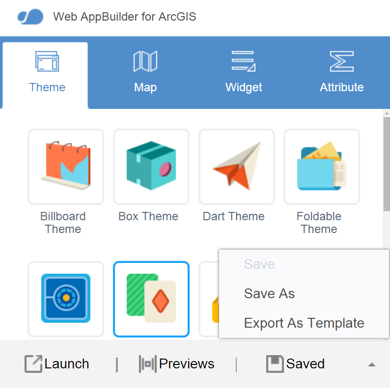
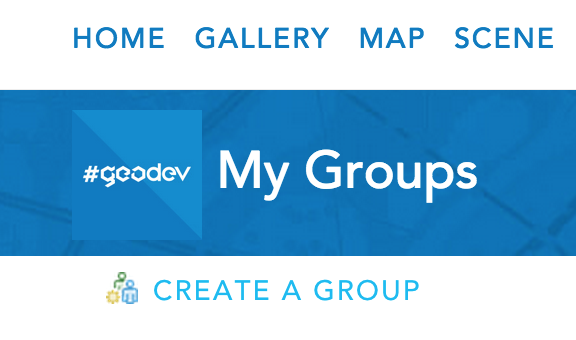

### Deploy your Web AppBuilder project to ArcGIS Online

Now that you have a customized Web AppBuilder application running on your own web server, we can make it available for other webmap authors in our Organization to take advantage of as well.

In this exercise, you will:
* **Register your local application as an ArcGIS Online Item**
* **Create a new group to share the item**
* **Ensure that ArcGIS Online is using content from this group when displaying templates**

1. On the Web AppBuilder homepage [http://[server]:3344/webappbuilder/](http://[server]:3344/webappbuilder/), click `Edit` for the application you would like to export as template.

2. In the `Theme` tab click the `^` to the right of the Saved button > `Export As Template` and select the individual options you want to make configurable for webmap authors later and then click `Export` > `Export to My Organization`.

3. Give the template a name, tags, description and save it in your folder of choice and click `OK`.

4. Choose `click here` to see the item details page for your new template and use the ‘share’ button to share with an appropriate group.
  * If you have not yet configured ArcGIS Online to surface custom templates to webmap authors it will be necessary to follow the steps below.

5. Click `Groups` (in the top lefthand corner of most ArcGIS Online pages) and choose `Create a Group`.  Fill in the appropriate details and share the Group within your organization.

6. Click `My Organization` > `Edit Settings` > `Map` in the `Web App Templates` choose the new group from the dropdown and click `Save`.

7. Afterwards, share your new template with this group.  (This would also be a good opportunity to confirm that it appears to webmap authors as a configurable template when they share their own maps).
