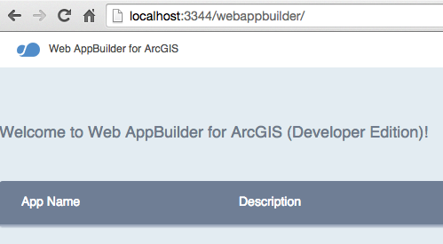

### Configure Web AppBuilder Developer Edition

In order to integrate custom widgets and themes its necessary to host applications on your own web server.  In this lab you will download Web AppBuilder Developer Edition and configure it to run on your local machine.

1. Download `arcgis-web-appbuilder-1.x.zip` from [developers.arcgis.com](https://developers.arcgis.com/en/downloads/) and unzip it in the folder of your choice.

2. Follow the instructions [here](https://developers.arcgis.com/web-appbuilder/guide/getstarted.htm) to confirm the builder is running.

3. Create an *AppID* for Web AppBuilder in [arcgis.com](http://www.arcgis.com) so that you can leverage OAuth to sign into ArcGIS Online (more info can be found [here](https://developers.arcgis.com/web-appbuilder/guide/getstarted.htm))

You are now ready to start creating web apps. Proceed to the next lab [Create a Web App](./web/wab_first_app.md). 

[http://localhost:3344/webappbuilder](http://localhost:3344/webappbuilder)

